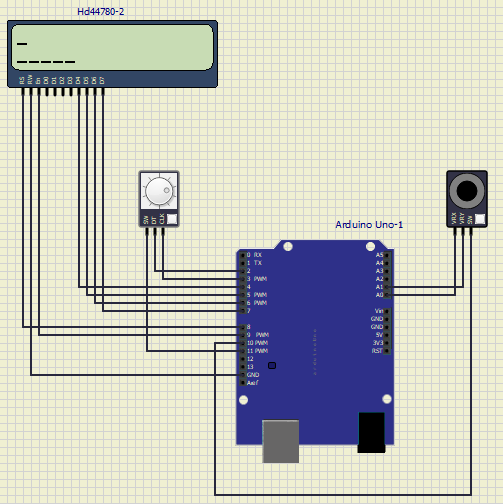
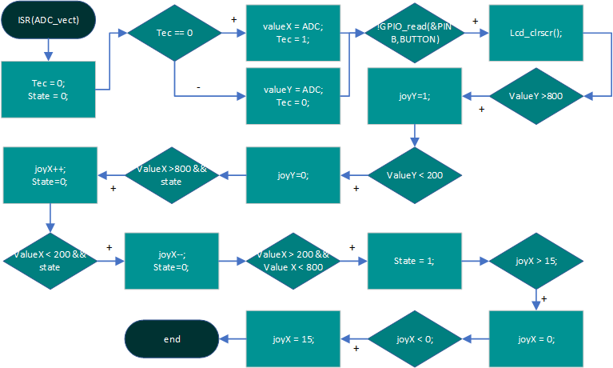
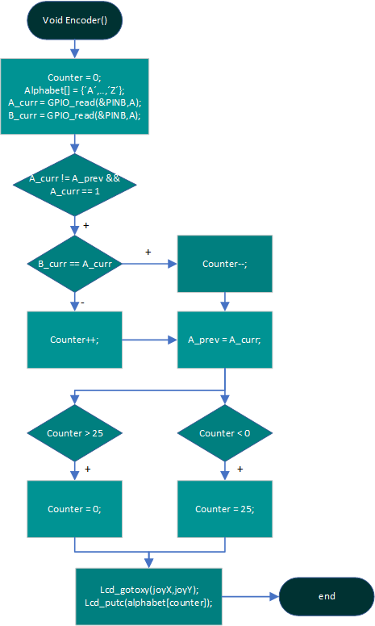

# Project 1

Application of analog joy-stick (2 ADC channels, 1 push button), rotary encoder, and Digilent PmodCLP LCD module.

## Instructions

The goal of the project is cooperation in pairs, further study of the topic, design of own solutions, implementation, creation of project documentation and presentation of results. The division of roles and tasks within the team is up to their members.

* Students work on a project in the labs during the 10th and 11th weeks of the semester.

* Through the BUT e-learning, students submit a link to the GitHub repository, which contains the complete project in PlatfomIO and a descriptive README file. The submission deadline is the day before the next laboratory, i.e. in 2 weeks.

* The source code for the AVR must be written in C and/or Assembly and must be implementable on Arduino Uno board using toolchains from the semester, ie PlatformIO and not in the Arduino-style. No other development tools are allowed.

## Recommended GitHub repository structure

   ```c
   YOUR_PROJECT        // PlatfomIO project
   ├── include         // Included files
   ├── lib             // Libraries
   ├── src             // Source file(s)
   │   └── main.c
   ├── test            // No need this
   ├── platformio.ini  // Project Configuration File
   └── README.md       // Report of this project
   ```

## Recommended README.md file structure

### Team members

* Member 1 Filip Seč(responsible for documentation, hardware setup and implementation of encoder in firmware)
* Member 2 Patrik Horčička(responsible for hardware setup and implementation of lcd, joystick in firmware)

## Hardware description
* In this project we will see how to display string of characters on display and after that with help of joystick controller and encoder you can choose direction:
* In this project we are using 4 main components such as: 
   * arduino uno - microcontroller for communication and control of other components through code
   * lcd display - for displaying charakters
   * joystick - for moving on the lcd display and its switch for cleaning the display
   * encoder - for changing charakter of the alphabet

### Scheme 



## Software description


### Flowchart of ISR(Timer)

### Flowchart of ISR(ADC)

### Flowchart of encoder

## Video
[Video of out project1](https://www.youtube.com/watch?v=v_LxInjTsTE)


## References

1. [Display manual](https://digilent.com/reference/_media/reference/pmod/pmodcls/pmodcls_rm.pdf)
2. [Arduino](https://www.arduino.cc/)
3. [De2](https://moodle.vut.cz/course/view.php?id=258370)
