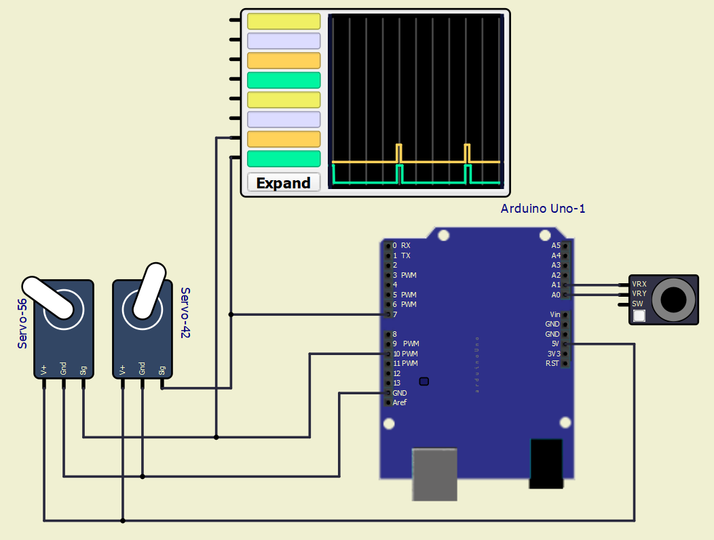
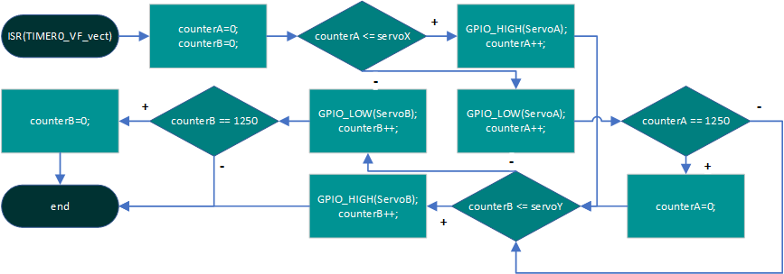
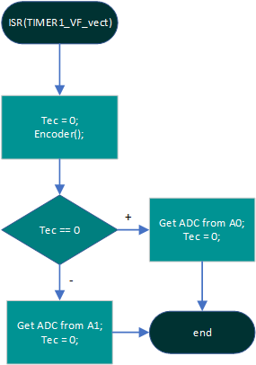
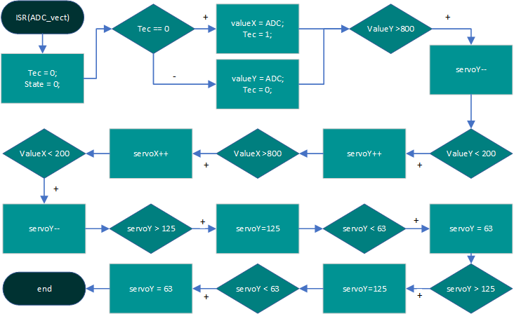

# Project 2

Precise generation of several PWM channels. Application of two (or more) Servo motors SG90.

## Instructions

The goal of the project is cooperation in pairs, further study of the topic, design of own solutions, implementation, creation of project documentation and presentation of results. The division of roles and tasks within the team is up to their members.

* Students work on a project in the labs during the 12th and 13th weeks of the semester.

* Through the BUT e-learning, students submit a link to the GitHub repository, which contains the complete project in PlatfomIO and a descriptive README file. The submission deadline is the day before the next laboratory, i.e. in 2 weeks.

* The source code for the AVR must be written in C and/or Assembly and must be implementable on Arduino Uno board using toolchains from the semester, ie PlatformIO and not in the Arduino-style. No other development tools are allowed.

## Recommended GitHub repository structure

   ```c
   YOUR_PROJECT        // PlatfomIO project
   ├── include         // Included files
   ├── lib             // Libraries
   ├── src             // Source file(s)
   │   └── main.c
   ├── test            // No need this
   ├── platformio.ini  // Project Configuration File
   └── README.md       // Report of this project
   ```

## Recommended README.md file structure

### Team members

* Patrik Horčička (Programming, schematic, flowcharts)
* Filip Sec (ReadME)

## Hardware description

* Arduino UNO
   * used as Microcontroller for our project
   * used for generating PWM signal for controling of servo motors 
   * used for reading the voltage from JoyStick, for controlling purposes 
* JoyStick
   * for controling of the movement of servo motors
   * JoyStick is giving the voltage on its ports VRx and VRy
   * voltage depends on the position of joystick in X and Y axis
* Servo Motors
   * strong but slow motors
   * for movement need defined PWM signal with period of 20ms and duty cycle in range of 1-2ms
   * the one we used can only operate in radius of 180°

### Scheme


## Software description

### Flowchart of ISR(Timer0)
* this method is used for controlling of the servo motor, for generating PWM signal <br />


### Flowchart of ISR(Timer1)
* this method is used for changing ADC pins for reading <br />


### Flowchart of ISR(ADC)
* this method is handling processing of the ADC <br />


## Practical use
* these parts can be used in environment where is a need of movement in two axis. 
   * when we connect two servo motor in serial, first can move in one axis and a second in second axis 
* we can see this features for example in excavators, where they also use one joystick for two axis

## Video
* video is showing practical use of our project in simulation enviroment 
* there can be also seen signals on logical analyzer, where we can see PWM signals for both servo motors
* [Video](https://youtu.be/9fueH01eipU)

## References

1. [Servo Motor Datasheet](https://robojax.com/learn/arduino/robojax-servo-sg90_datasheet.pdf)
2. [Arduino](https://www.arduino.cc/)
3. [De2](https://moodle.vut.cz/course/view.php?id=258370)