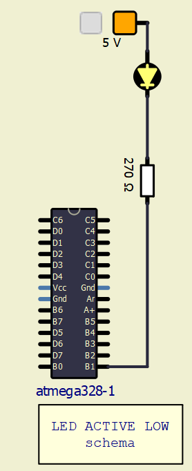

# Lab 1: Patrik Horcicka

### Morse code

1. Listing of C code which repeats one "dot" and one "comma" (BTW, in Morse code it is letter `A`) on a LED. Always use syntax highlighting, meaningful comments, and follow C guidelines:

```c
#define SHORT_DELAY 250
#define LONG_DELAY 750

int main(void)
{   
    // Set pin where on-board LED is connected as output
    pinMode(LED_GREEN, OUTPUT);

    // Infinite loop
    while (1)
    {
        //dot
        digitalWrite(LED_GREEN, LOW);
        _delay_ms(SHORT_DELAY);
        //delay in letter
        digitalWrite(LED_GREEN, HIGH);
        _delay_ms(SHORT_DELAY);
        
        //comma
         digitalWrite(LED_GREEN, LOW);
        _delay_ms(LONG_DELAY);
        //delay between letters
        digitalWrite(LED_GREEN, HIGH);
        _delay_ms(LONG_DELAY);

    }

    // Will never reach this
    return 0;
}
```

2. Scheme of Morse code application, i.e. connection of AVR device, LED, resistor, and supply voltage. The image can be drawn on a computer or by hand. Always name all components and their values!

   

